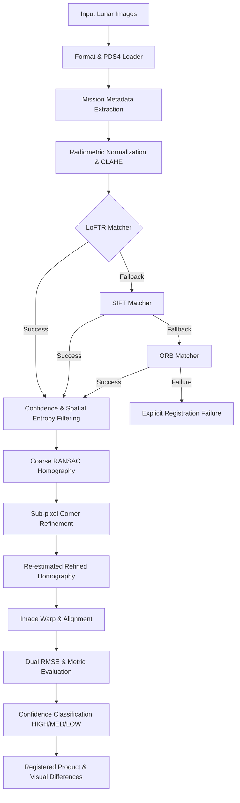

# LunarMatch AI — System Architecture Specification

## 1. High-Level Architecture Overview

LunarMatch AI employs a robust hybrid computer vision architecture designed for multi-modal, sun-angle invariant, and scale-invariant lunar orbital registration.

---

## 2. Core Subsystems

### 2.1 PDS4 & Format Loader (`ml-service/app/pipeline/loader.py`)
- Direct support for single-file GeoTIFF / PNG / JPEG / BMP rasters and multi-file PDS4 (`.img` + `.xml`) and PDS3 (`.img` + `.lbl`).
- Extracts mission attributes: payload, sensor camera, acquisition timestamp, resolution, solar azimuth, solar elevation, and altitude.

### 2.2 Radiometric Preprocessing (`ml-service/app/pipeline/preprocess.py`)
- Percentile-based contrast stretch ($2\% - 98\%$) to preserve shadow detail on crater floors and illuminated rims.
- CLAHE (Contrast Limited Adaptive Histogram Equalization) with $8 \times 8$ grid tiles for sun-angle invariance.
- Non-Local Means / Gaussian denoising.

### 2.3 Hybrid Correspondence Engine (`ml-service/app/models/loftr_matcher.py`, `matching.py`)
- **LoFTR**: Local Feature TRansformer with self and cross-attention layers to establish detector-free dense correspondence across low-texture regolith.
- **SIFT**: Scale-Invariant Feature Transform with 128-d gradient descriptors for deterministic fallback.
- **ORB**: Fast oriented binary descriptors for low-resource secondary fallback.
- **Normalized Spatial Entropy**: $U = H / \ln(64)$ across an $8 \times 8$ grid to prevent spatial clustering of matches.

### 2.4 Sub-pixel Refinement & Geometry (`ml-service/app/pipeline/geometry.py`, `refine.py`)
- Coarse RANSAC / USAC-MAGSAC planar homography ($3.0\text{ px}$ threshold).
- Local patch eigenvalue structure verification before sub-pixel optimization with `cv2.cornerSubPix`.
- Fine RANSAC pass ($1.5\text{ px}$ threshold) on refined sub-pixel coordinates.

### 2.5 Dual RMSE Validation & Confidence System (`ml-service/app/pipeline/evaluate.py`, `confidence.py`)
- Measures both **Fit RMSE** (on fitting inliers) and **Independent Test RMSE** (on held-out test points).
- Computes comprehensive confidence grade: `HIGH` ($\ge 0.70$), `MEDIUM` ($0.40 - 0.70$), `LOW` ($< 0.40$).
